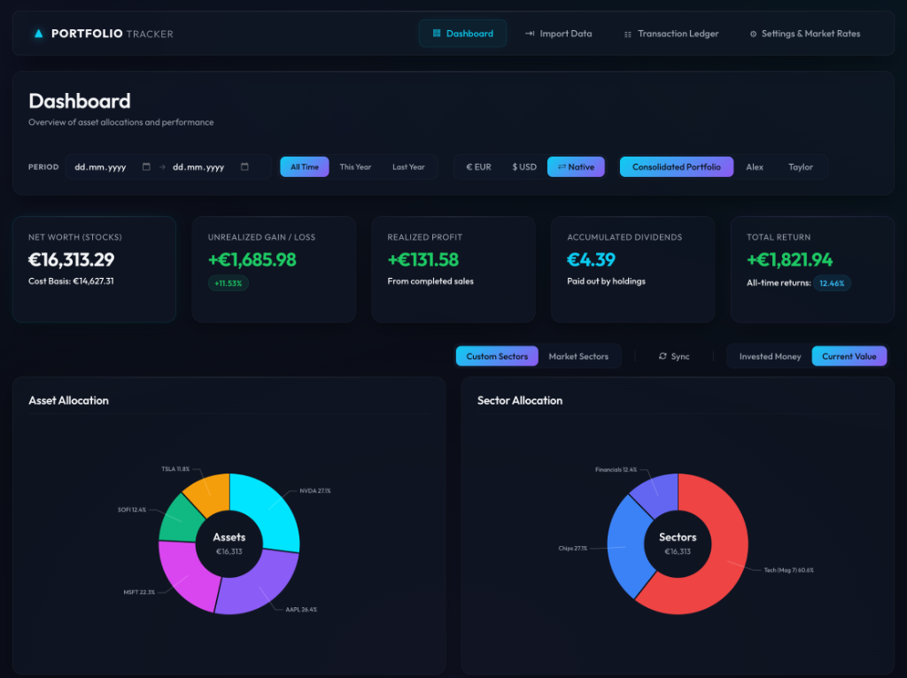
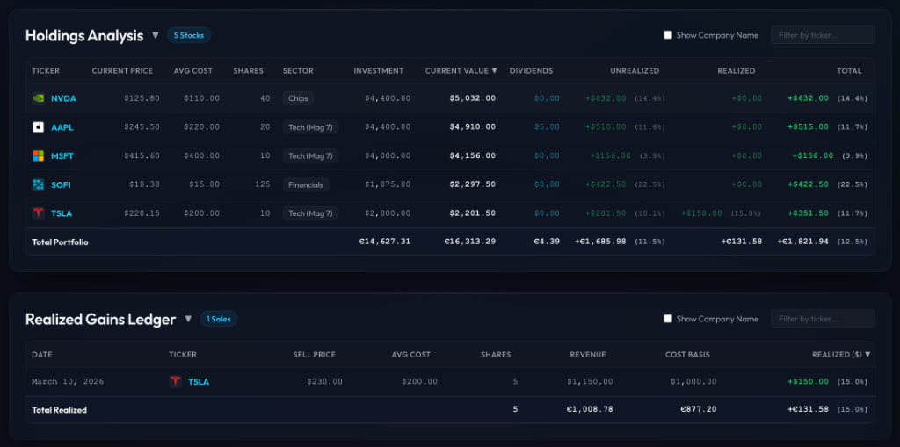
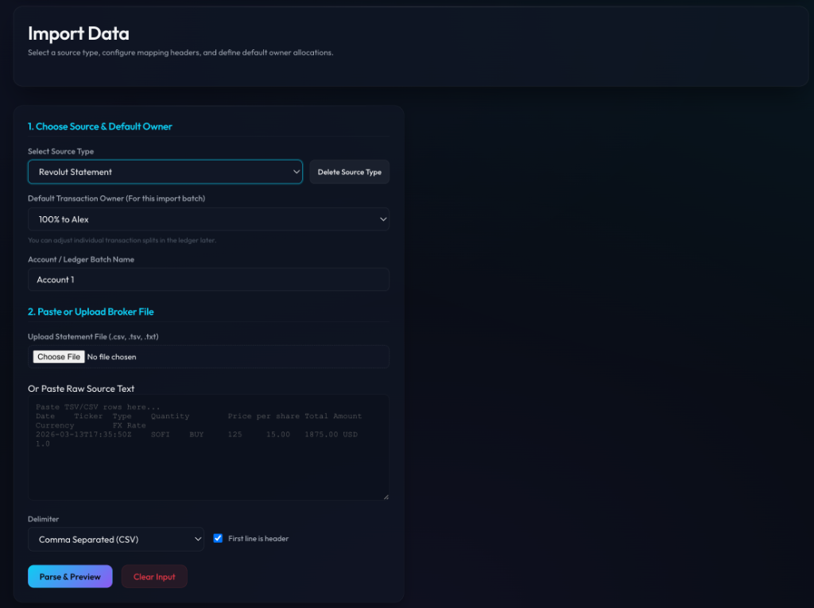
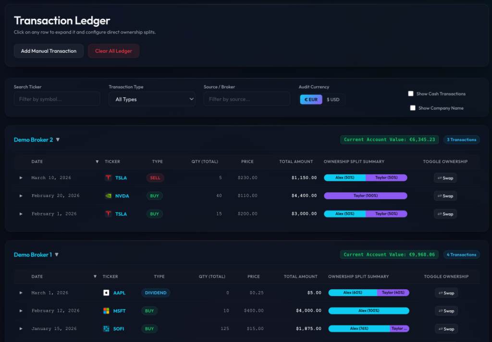
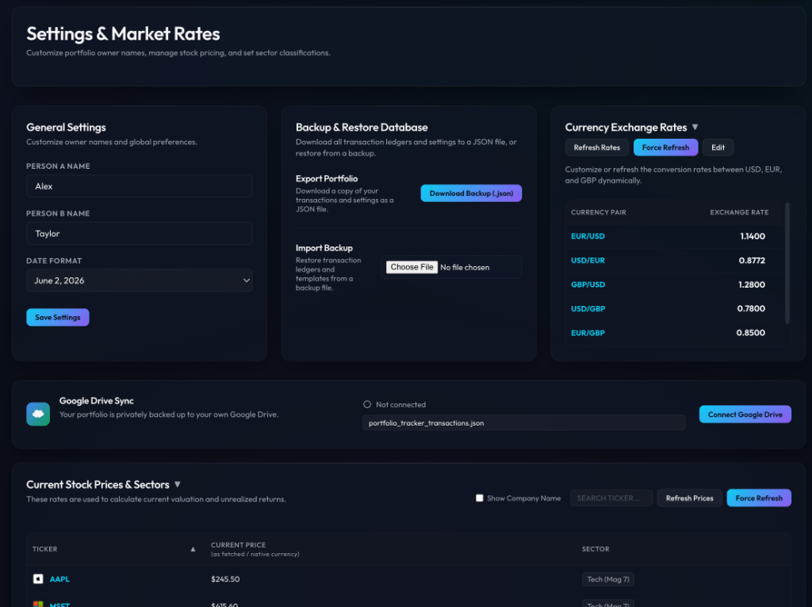

# 📈 Portfolio Tracker

A sleek, private investment portfolio tracker. No accounts. No subscriptions. Your data stays yours — stored locally in your browser or synced to your own Google Drive.

**Live app → [antstickpie.github.io/Portfolio-tracker](https://antstickpie.github.io/Portfolio-tracker/)**

> ⚠️ **Fully AI-generated code.** This entire application was built by an AI coding assistant (Google Antigravity) with zero human code review. The only human validation was verifying the correctness of the financial calculations and portfolio math. Use at your own discretion.

---

## Screenshots

### Dashboard


### Holdings & Allocations


### Import Data


### Transaction Ledger


### Settings & Google Drive Sync


---

## Features

- **Dashboard** — Total value, unrealized & realized gains, dividends, asset allocation charts, and historical performance timeline
- **Holdings** — Live P&L per position with sorting by gain/loss, and live FX rate visibility
- **Transactions** — Full ledger with CSV/Excel import from Trading212, Revolut, Vested, and custom formats
- **Cost Basis Methods** — Toggle between FIFO (First-In, First-Out) and Average Cost basis calculations
- **Stock Splits** — Auto-fetching and caching of historical stock splits, with per-source split-adjustment settings
- **Account Management** — Temporarily disable or delete specific account sources directly from the ledger
- **Multi-owner** — Split portfolios between two people (e.g. you and a partner)
- **Google Drive Sync** — Auto-backup to your private Google Drive, accessible from any device
- **Market Prices** — Centralized live prices & exchange rates status in the navbar with manual force sync
- **Sectors** — Auto-classify stocks into sectors for allocation charts

---

## Getting Started

### Single Person

1. Open the app — it loads with demo data so you can see how it looks
2. Go to **Transaction Ledger** → click **Clear All Ledger** to wipe demo data
3. Go to **Import Data** → import your broker CSV (see below)
4. Go to **Settings** → **Refresh Prices** to fetch live market prices
5. Head to **Dashboard** to see your portfolio

> In **Settings → General Settings**, you can rename "Person A" to your own name. Leave Person B blank — it won't appear anywhere.

---

## Two Person Mode

Track two separate portfolios in one app — each person sees their own P&L.

**Setup:**
1. Go to **Settings → General Settings** → set Person A name (e.g. *Alex*) and Person B name (e.g. *Taylor*)
2. When importing, choose **"100% to Alex"** or **"100% to Taylor"** as the default owner for that batch
3. For shared purchases, choose **"Split 50/50"** — or fine-tune per transaction in the **Transaction Ledger** by clicking any row and adjusting the ownership slider

**Viewing:**
- **Dashboard** → toggle between *Alex*, *Taylor*, or *Consolidated Portfolio* at the top
- **Holdings** and **Realized Gains** tabs show the same toggle
- Each person sees only their allocated shares and cost basis

---

## Importing Transactions

### Built-in formats (zero config)

| Broker | How to export |
|---|---|
| **Trading212** | Account → History → Export as CSV |
| **Revolut** | Stocks → Statements → Export CSV |
| **Vested** | Profile → Reports → Transactions (Export Excel) |

Select the source type in the dropdown → paste or upload the file → click **Parse & Preview** → **Import**.

### Custom CSV format

If your broker isn't listed:

1. Go to **Import Data** → select any existing source type as a starting point
2. Export a CSV from your broker and paste it into the text area
3. Click **Parse & Preview** — the app shows a column preview
4. Use the **column mapping** dropdowns to tell the app which column means what:
   - **Date** — the transaction date
   - **Ticker** — stock symbol (e.g. AAPL)
   - **Type** — BUY / SELL / DIVIDEND
   - **Quantity** — number of shares
   - **Price** — price per share
   - **Total Amount** — total cost of the transaction
   - **Currency** — USD / EUR / GBP
   - **FX Rate** — exchange rate (optional)
5. Click **Save as Source Type** → give it a name → it's saved for future imports

---

## Google Drive Sync

Sync your portfolio across devices without any server or account.

1. Go to **Settings** → **Google Drive Sync**
2. Click **Connect Google Drive**
3. Approve access in the Google popup
4. Done — your data syncs automatically on every change

> Your data is stored in a private file in **your own** Google Drive. Nobody else can access it.

---

## Running Locally

```bash
npm install
npm start
```

Open [http://localhost:4200](http://localhost:4200)

---

## Tech Stack

- Angular 19 (standalone components)
- Vanilla CSS (dark glassmorphism design)
- Google Drive REST API + GIS OAuth (client-side only)
- Hosted free on GitHub Pages
